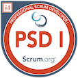
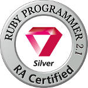
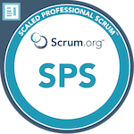

# About me
An engineer, an origami crafter and a drum & percussion player. Born in Hanoi. Living in Japan since 2020

As an engineer, I love Ruby on Rails, AWS, ReactJS and Scrum.

# Education and works
## Education
- **2011-2014** HUS High School for Gifted Students - Math Speciality
- **2014-2019** Hanoi University of Science and Technology - HEDSPI Project, Engineer Degree in IT

## Internships
- **11/2016-09/2017** Ominext JSC(now Ominext Group), front-end intern
- **06/2018-08/2018** Alt Plus Vietnam(now Extreme Vietnam), PHP intern
- **06/2019-08/2019** Sun Asterisk Vietnam, Ruby intern

## Works

1. **02/2020-07/2021** Actindi, Web Engineer

Ikoyo, improve the operation of the service called Ikorepo
- Investigate site traffic with NewRelic, DataDog
- Deploy with CodePipeline
- Write code and unit tests to improve product operations
- Ikoyo's case:
  - Update Rails version
  - SEO improvement
  - Ikoyo Premium
- IkoRepo project:
  - Update Rails version

1. **08/2021-03/2022** VNEXT JAPAN, System Engineer
- Project: Recruitment system
System overview: from your current multiple systems

Responsibilities: Using AWS services (Data Pipeline, Glue ETL, Athena) to migrate data from CSV files into AWS Auroura Postgres SQL

Environment: AWS

1. **04/2022-now** VTI JAPAN, System Engineer
- Project: FHIR system 
System overview: processing medical data to FHIR standards 
Role: Systems Engineer 
Responsibilities: Serverless Framework, AWS services (Lambda, Step Functions, API Gateway), C#.
Environment: AWS

- Project: Legacy Code Project
System Overview: Add new functions according to customer requests
Role: Systems Engineer 
Responsibility: Customer code language that is a legacy code system, no documentation and the macros' and variables' name in Japanese.
Environment: Windows

 - Project: Administrative document management system
System overview: System for managing administrative documents
Role: Business Analyst 
Responsibilities: Summarize customer wishes and feedback, organize offshore development team
Communicate progress and manage offshore child team (3 people)

 - Project: Air ticket sales system 
System overview: Air tickets, hotels, taxis, sightseeing tickets, etc.

Role: Programmer
Responsibilities: Programming, writing unit tests, integration testing

Environment: Java, Windows

# My IT blogs

- [Viblo](https://viblo.asia/u/devil_boom_129)

- [Blogs at Actindi](https://tech.actindi.net/archive/category/quan)

- [Blogs at VTI](https://vtitech.vn/tag/gryqhon/)

# My Ruby Exam courses

- https://learn.viblo.asia/en/courses/ruby-association-certified-ruby-programmer-silver-ruby-silver-wMvbmOeYAl

- https://learn.viblo.asia/en/courses/ruby-association-certified-ruby-programmer-gold-ruby-gold-4openRe7Az

# Certs and badges

All at [Credly](https://www.credly.com/users/duc-quan-hoang/badges) and [Accredible Credential](https://www.credential.net/profile/hoangquan691429/wallet):

 
  
  [AWS Certified Solutions Architect - Associate(04/2021 - 04/2024)](https://www.credly.com/badges/17efe8cf-9ea6-459f-ade9-dc22fff82000)

 
  
   [Professional Scrum Master I](https://www.credly.com/badges/02b796b7-b597-4cd7-b0d5-c547de1e23d4)

 
  
   [Professional Scrum Master II](https://www.credly.com/badges/142143ea-9211-420d-b94a-27632578dc0f)

 
  
   [AWS Certified Developer - Associate(03/2022 - 03/2025)](https://www.credly.com/badges/35bcfa40-10ae-420f-8e7c-3dd35c1c16aa)
   
 
 
   [Professional Scrum Developer™ I (PSD I)](https://www.credly.com/badges/64c9b6c3-ce14-407c-ba93-174d6eb15d14)

 
 
   [Ruby Association Certified Ruby Programmer Silver](https://www.credential.net/d6b90bcc-0a14-4039-94ba-5443ea9dd343)

 
   
   [Scaled Professional Scrum™ (SPS)](https://www.credly.com/badges/677aab13-e8b3-46e7-b93f-d1ac003f26c9)
   
 
 
   [Ruby Association Certified Ruby Programmer Gold](https://www.credential.net/3c8a0b29-cc9d-4249-a148-ddf1800e53d9)

# Hobbies

As an origami crafter, I have my own Instagram of origami show cases.

As a drummer, well, I learning and practicing myself and hope to be on a band in Tokyo. My favorite artists are Buc Tuong, Microwave(from Vietnam), Linkin Park, Avenged Sevenfold(US-UK), SCANDAL, X Japan and One OK Rock(Japan)

# Email and links

Email: quanhoangd129@gmail.com

https://blazingrockstorm.github.io/

https://www.linkedin.com/in/hoang-quan-8418a7155/
