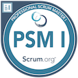
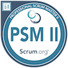
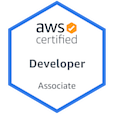

# About me

# Education and works

# My IT blogs

- [Viblo](https://viblo.asia/u/devil_boom_129)

- [Blogs at Actindi](https://tech.actindi.net/archive/category/quan)

# Certs and badges

All at [Credly](https://www.credly.com/users/duc-quan-hoang/badges) :

 
  
  AWS Certified Solutions Architect - Associate(04/2021 - 04/2024)

 
  
   Professional Scrum Master I

 
  
   Professional Scrum Master II

 
  
   AWS Certified Developer - Associate(03/2022 - 03/2025)

# Origami showcase

<iframe width="320" height="440" src="https://www.instagram.com/gryqhon_origami?utm_source=ig_embed" frameborder="0"></iframe>

# My Playing Music

# Links

[Facebook](https://www.facebook.com/rocker.gryphon)

[Instagram](https://www.instagram.com/gryqhon_origami/)

[Linkedin](https://www.linkedin.com/in/hoang-quan-8418a7155/)
